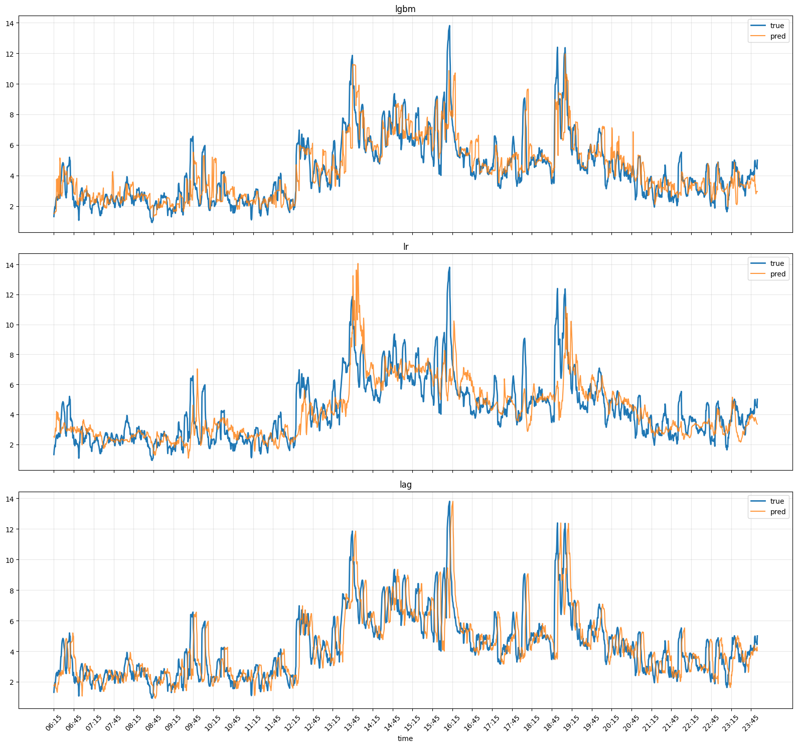
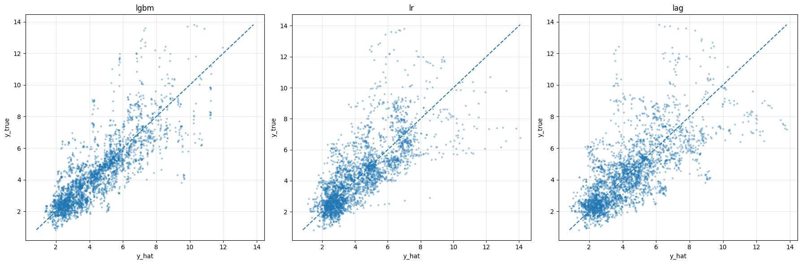

# Volatility Prediction for Market Making

本项目展示了一个面向高频订单簿数据的波动率预测流水线。核心目标是把实盘采集的 `snapshot` 数据与外部 volatility 数据对齐，构造基础因子、邻居特征和滚动训练样本，并最终训练 `LightGBM` 模型，为做市策略提供辅助信号。

这个仓库更偏向“研究型 pipeline / feature engineering”，重点不在单一模型本身，而在于如何把高频数据处理、特征构造、缓存分层和滚动训练组织成一个可复用的工程框架。

## Why This Project

- 面向高频订单簿场景，输入粒度接近 `20ms`
- 将原始市场数据处理链路拆成清晰的多阶段 pipeline
- 支持先构建 cache，再滚动生成训练集和预测结果
- 通过 time neighbor / symbol neighbor 特征增强横截面与时序信息
- 使用 `LightGBM` 做滚动训练与评估，输出预测结果和特征重要性

## Problem Setting

目标标签默认是未来波动率 `y_vol_5m`。项目将订单簿快照中的价格和数量信息转成结构化特征，再结合历史 volatility 特征，预测未来一段时间内的波动率水平。该预测结果可作为做市中的风险控制、挂单位置调整和仓位管理的辅助输入。

## Result Snapshot

下面几张图展示了当前 rolling training / prediction 流程产出的代表性结果。（只作为展示说明）

### Prediction vs Label



这张图是真实值和预测值的对比，相比与 linear regression 和 lag 可以看出无论在高波动还是低波动的拟合上都有明显提高

### Scatter Plot



这组散点图中可以看出，lgbm 相比于 linear regression 和 lag，特别是在高波动率部分的variance 明显变小。

## Pipeline Overview

项目当前主框架集中在 [feature_pipeline_skeleton/main.py](feature_pipeline_skeleton/main.py) 及其配套模块，整体采用 `reader -> builder -> sink -> stage -> pipeline` 的分层设计。

完整流程分为两段：

1. `cache pipeline`
   先生成单币种对齐数据，再聚合成跨币种 block cache。
2. `main pipeline`
   在已有 cache 的基础上继续构建历史窗口、邻居特征、ready block、滚动训练数据，并完成模型训练。

### Stage Breakdown

1. `BuildAlignedStage`
   读取原始 `snapshot` 和 volatility 数据，完成时间对齐、基础因子构造和标签追加。
2. `BuildBlockCacheStage`
   将同一交易日内多个币种的数据按固定 block 频率聚合，形成中间 cache。
3. `BuildWindowCacheStage`
   读取目标日及其历史 block cache，生成训练窗口和目标查询窗口。
4. `BuildNeighborStage`
   基于历史窗口构造 time neighbor feature 和 symbol neighbor feature。
5. `BuildReadyBlockStage`
   将邻居特征与基础特征、标签拼接成模型可直接消费的 `ready block`。
6. `BuildTrainingDatasetStage`
   生成按日滚动的训练 / 验证 / 预测样本，并落盘为 `npz`。
7. `TrainFromNPZStage`
   使用 `LightGBM` 完成训练、预测和评估。

## Repository Structure

- [feature_pipeline_skeleton](feature_pipeline_skeleton): 主 pipeline 框架和运行入口
- [data](data): 数据路径配置、原始读取、对齐和通用清洗逻辑
- [factor_phase_I](factor_phase_I): 基础订单簿因子构造
- [factor_phase_II](factor_phase_II): ready block 与滚动训练样本生成
- [neighbor](neighbor): 时间邻居 / 币种邻居特征构造
- [analysis](analysis): 训练结果评估和分析辅助函数

## Key Modules

- [main.py](feature_pipeline_skeleton/main.py): pipeline 装配、日期范围执行入口
- [stages.py](feature_pipeline_skeleton/stages.py): 每个 stage 的执行边界
- [builders.py](feature_pipeline_skeleton/builders.py): 各阶段的核心计算逻辑
- [readers.py](feature_pipeline_skeleton/readers.py): 上游输入读取
- [sinks.py](feature_pipeline_skeleton/sinks.py): 中间产物和结果落盘
- [snapshot.py](factor_phase_I/snapshot.py): 基础 snapshot 因子
- [build_neighbors.py](neighbor/build_neighbors.py): 邻居特征生成
- [evals.py](analysis/evals.py): 预测指标评估

## Data Assumptions

出于数据保密原因，仓库不包含真实交易数据，且因子，币种和运行结果匀只作为展示目的。当前代码默认依赖两类私有输入：

- 订单簿快照 `snapshot`
- 外部 volatility 数据 `npz`

如果要在本地复现，需要把你自己的数据路径接到 [config.py](data/config.py) 中的配置项，或进一步改造成环境变量 / YAML 配置方式。

## Environment Setup

建议使用 Python `3.11+`。

```bash
python -m venv .venv
source .venv/bin/activate
pip install -r requirements.txt
```

## How To Run

当前最直接的运行方式是：

```bash
python feature_pipeline_skeleton/main.py
```

默认入口会：

1. 先构建一段 warmup 历史 cache
2. 再按日期范围运行主训练流程

如果你只想理解流程，建议先从以下两个函数开始看：

- `run_cache_pipeline_range(...)`
- `run_main_pipeline_range(...)`

对应代码在 [main.py](feature_pipeline_skeleton/main.py)。

## Main Outputs

流程默认会生成以下产物：

- `aligned parquet`
- `block cache`
- `window cache`
- `neighbor features`
- `ready blocks`
- `rolling npz`
- `LightGBM results`

README 中展示的图主要对应以下分析产物：

- 预测值与真实值关系图
- 误差 / 分布散点诊断图

